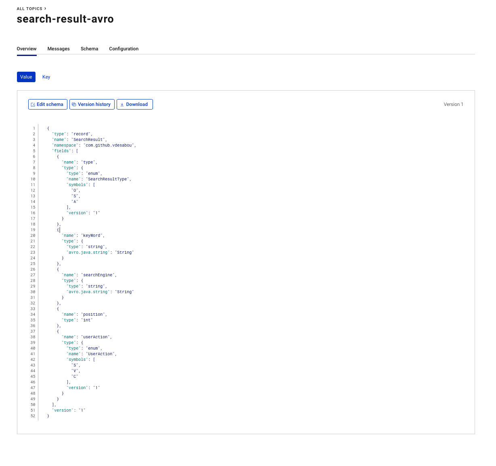

# Split Apache Avro schema across multiple files

## Objective

Testing this StackOverflow [answer](https://stackoverflow.com/a/22225224)

## What is been done

[SearchResult](https://github.com/vdesabou/kafka-scratchpad/blob/master/java_producer_split_avro_files/src/main/resources/avro/search_result.avro) Avro record has `UserAction` and `SearchResultType` types:


```json
{
    "namespace": "com.github.vdesabou",
    "type": "record",
    "name": "SearchResult",
    "version": "1",
    "fields": [
        {
            "name": "type",
            "type": "SearchResultType"
        },
        {
            "name": "keyWord",
            "type": "string"
        },
        {
            "name": "searchEngine",
            "type": "string"
        },
        {
            "name": "position",
            "type": "int"
        },
        {
            "name": "userAction",
            "type": "UserAction"
        }
    ]
}
```

[SearchResultType](https://github.com/vdesabou/kafka-scratchpad/blob/master/java_producer_split_avro_files/src/main/resources/avro/search_result_type.avro) is defined in `search_result_type.avro`file:

```json
{
    "namespace": "com.github.vdesabou",
    "type": "enum",
    "name": "SearchResultType",
	"version": "1",
    "symbols": [
        "O",
        "S",
        "A"
    ]
}
```

[UserAction](https://github.com/vdesabou/kafka-scratchpad/blob/master/java_producer_split_avro_files/src/main/resources/avro/user_action.avro) is defined in `user_action.avro`file:

```json
{
    "namespace": "com.github.vdesabou",
    "type": "enum",
    "name": "UserAction",
	"version": "1",
    "symbols": [
        "S",
        "V",
        "C"
    ]
}
```

SearchResult records are created with

```java
SearchResult searchresult = SearchResult.newBuilder()
.setKeyWord(faker.name().username())
.setType(SearchResultType.A)
.setSearchEngine(faker.name().name())
.setPosition(1)
.setUserAction(UserAction.C)
.build();
```

## Results:

Logs:

```
Produced record to topic search-result-avro partition [0] @ offset 12
Sending alice {"type": "A", "keyWord": "benedict.jacobs", "searchEngine": "Gerry Toy", "position": 1, "userAction": "C"}
Produced record to topic search-result-avro partition [0] @ offset 13
Sending alice {"type": "A", "keyWord": "audra.stehr", "searchEngine": "Jaquan Hammes", "position": 1, "userAction": "C"}
Produced record to topic search-result-avro partition [0] @ offset 14
Sending alice {"type": "A", "keyWord": "nikolas.gibson", "searchEngine": "Fannie Aufderhar", "position": 1, "userAction": "C"}
Produced record to topic search-result-avro partition [0] @ offset 15
Sending alice {"type": "A", "keyWord": "julio.zboncak", "searchEngine": "Myrtice Christiansen DDS", "position": 1, "userAction": "C"}
Produced record to topic search-result-avro partition [0] @ offset 16
Sending alice {"type": "A", "keyWord": "isaiah.bergstrom", "searchEngine": "Jett Hilpert I", "position": 1, "userAction": "C"}
Produced record to topic search-result-avro partition [0] @ offset 17
```

In Confluent Schema registry, the schema looks like:

```json
{
  "type": "record",
  "name": "SearchResult",
  "namespace": "com.github.vdesabou",
  "fields": [
    {
      "name": "type",
      "type": {
        "type": "enum",
        "name": "SearchResultType",
        "symbols": [
          "O",
          "S",
          "A"
        ],
        "version": "1"
      }
    },
    {
      "name": "keyWord",
      "type": {
        "type": "string",
        "avro.java.string": "String"
      }
    },
    {
      "name": "searchEngine",
      "type": {
        "type": "string",
        "avro.java.string": "String"
      }
    },
    {
      "name": "position",
      "type": "int"
    },
    {
      "name": "userAction",
      "type": {
        "type": "enum",
        "name": "UserAction",
        "symbols": [
          "S",
          "V",
          "C"
        ],
        "version": "1"
      }
    }
  ],
  "version": "1"
}
```



